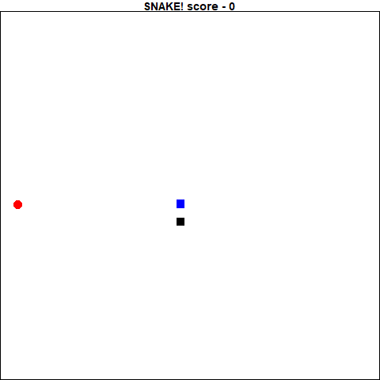

```{r setup, include = FALSE}
knitr::opts_chunk$set(
  collapse = TRUE,
  comment = "#>",
  eval=FALSE
)
```

Reinforcement learning is an interesting technique where in the user gives a model a game state and requests that it produce some sort of reaction to the state. This action is then fed back into the model to generate the next state. If the result of this action is a positive reaction, it is recorded and the model is fit to imply this action is a good one. If the result is negative, the inverse.

Eventually, after playing many games, the algorithm starts to make connections between states and the "correct" action to take. 

```{r eval=TRUE, echo=FALSE}
nomnoml::nomnoml("
[Model]->[Action]
[Action]->[Game/Simulation]
[Game/Simulation]->[reward]
[Game/Simulation]->[state]
[reward]->[Model]
[state]->[Model]
")
```

State. React. Reward. 

By repeating these steps thousands of times, the deep learning algorithm "learns" the rules of the game to great effect. There are currently lots of blogs and articles devoted to this type of machine learning available in python, but none in R. I decided it was time to both learn how to do this and record it for my fellow R programmers. 

The intention of this piece is to give an introduction to reinforcement learning. At the end I was successful in training a simple densely connected model to play the classic game "Snake" using a smaller set of parameters traditionally used in reinforcement learning. Below are two gif's. The gif on the left is the very first game it played, and the gif on the right is my final dense model's best performance.

<div style="text-align:center">
  
  
</div>

## Getting Started

My experience with deep learning is based on reading the [Deep Learning in R](https://www.manning.com/books/deep-learning-with-r) book by François Chollet with J. J. Allaire. Thankfully, I found several very helpful posts online that I used to help develop my programs. Keon Kim's blog contained a very useful introduction to reinforcement learning in ['Deep Q-Learning with Keras and Gym'](https://keon.io/deep-q-learning/), and Mauro Como's article ['How to teach AI to play Games: Deep Reinforcement Learning'](https://towardsdatascience.com/how-to-teach-an-ai-to-play-games-deep-reinforcement-learning-28f9b920440a) helped me develop my framework. Finally, I reviewed the paper from [the DeepMind team](https://storage.googleapis.com/deepmind-media/dqn/DQNNaturePaper.pdf), which really helped my understanding of the algorithm and design decisions made.

## Deep Q Network

At the heart of the training is the Deep Q Network (DQN) algorithm. The idea is that we have a function (Q) that given a state, give an action to maximize the reward. Putting this in terms of the snake game, if the head of the snake is just to the left of the food, the move that is most likely to give it a reward would be to move to the right.

The Q function is a concept that is actually fairly straight forward. Given a state, it will have probabilities of selecting a specific action that will give it some reward. Whichever the highest probability is, the Q function will select that action. So, given the table below, where there are 3 actions and N states,

```{r echo=FALSE, eval=TRUE,warning=FALSE}

library(kableExtra)

q<-data.frame("State"=c("1","2","3","...","N"),
           "Action 1"=c(".5",".25",".001","...",".0125"),
           "Action 2"=c(".01",".68",".034","...",".645"),
           "Action 3"=c(".063",".005",".9","...",".631"))
names(q)<-c("State","Action 1","Action 2","Action 3")

kable_styling(kable(q,row.names = FALSE,format = "html"),bootstrap_options = "striped", full_width = F)


```

If the state is state 2, the 3 actions have a probability of .001,.034 and .9 of returning a reward. So the q function will select `Action 3`. 

Now as we never actually know the "true" Q function, it is updated over time given the new information gathered about the environment and the states. The "deep" part of the DQN agent is that Q function is a deep learning algorithm as opposed to an a table of types.

I created a refclass called "DQN_agent", that served as the framework for serving my models. It was surprisingly simple to set up, as there are not a lot of states for it to handle. I also created an object made to hold all the information needed to train each step and the methods, called "memory".

### Memory Refclass

Refclasses can be a bit funny, but essentially it has field for containing data, and methods. They behave more similarly to other languages objects in that they are edited in-place. This memory refclass has field for each of the bits of information needed to train the model: current state, next state, action, reward and whether the game game is done or not. It also has a field for the number of states it holds to make things simpler. 

It also has methods for adding more data and sampling the outputs. Unless you are working with the DQN agent, it is unlikely you will work directly with this class.

<details>
  <summary>Toggle For Code</summary>
```{r memory}

memory<-setRefClass("memory",
            fields=list(
              state="list",
              next_state="list",
              reward="list",
              action="list",
              done="list",
              nstates="numeric"),
            methods=list(
              initialize=function(){
                nstates<<-0
              },
              add=function(s1,r,a,d,s2){
                state<<-c(state,list(s1))
                reward<<-c(reward,list(r))
                action<<-c(action,list(a))
                done<<-c(done,list(d))
                next_state<<-c(next_state,list(s2))
                nstates<<-nstates+1
              },
              sample=function(x){
                if(x=="latest"){
                  minibatch<-nstates
                }else if(x=="all"){
                  minibatch<-seq(nstates)
                }else{
                  minibatch<-base::sample(seq(nstates),x,replace = FALSE)
                }
                lapply(minibatch,function(idx){
                  list(
                    state = state[[idx]],
                    action = action[[idx]],
                    reward = reward[[idx]],
                    done = done[[idx]],
                    next_state = next_state[[idx]]
                    )
                })
              }
            ))


```
</details>

### DQN_agent Refclass

Similarly to the memory refclass, the DQN_agent has fields for the model, and information/settings required for training the model. You might notice that one of the fields is actually holding a memory refclass object. 

There are a few more methods for this class than for memory, but it boils down to this:

1. initialize is a method to write the various decisions on training. Gamma is the degree to which the Q function will be updated, epsilon and epsilon decay are for how much randomness is introduced while training the model. The larger the epsilon decay, the longer there will be randomness. epsilon is any value between 1 and 0.
2. add_model is a utility for saving the model you define into the DQN_agent.
3. remember adds the state to the memory field.
4. train_long is the method to train the model on potentially all the available data (or a subset) within the memory object.
5. train_on is the method to train the model on a specific state/next_state pairing. 
6. next_step is the method for producing an action to take based on the trained model.

<details>
  <summary>Toggle For Code</summary>
```{r DQN_agent}

DQN<-setRefClass("DQN_agent",
                 fields=list(
                   model="list",
                   mem="memory",
                   gamma="numeric",
                   epsilon="numeric",
                   e_decay="numeric"
                 ),
                 methods=list(
                   initialize=function(gamma=.9,epsilon_decay=400){
                     gamma<<-gamma
                     epsilon<<-1
                     e_decay<<-epsilon_decay
                     mem<<-new("memory")
                   },
                   add_Model=function(model){
                     model<<-list(model)
                   },
                   
                   remember=function(s1,r,a,d,s2){
                     mem$add(s1,r,a,d,s2)
                   },

                   train_long=function(len=1000){
                     if( mem$nstates > len){
                       minibatch = mem$sample(len)
                     }else{
                       minibatch = mem$sample("all")
                     }

                     for(x in minibatch){
                       target = x$reward
                       if(!x$done){
                         target = x$reward + 
                           gamma * max(next_step(x$next_state))
                       }
                       target_f = next_step(x$state)
                       target_f[which.max(x$action)] = target

                       tempModel<-model[[1]]

                       fit(tempModel,
                           x$state,
                           array(target_f,dim=dim(x$action)),
                           epochs=1,
                           verbose=0)

                       model<<-list(tempModel)
                     }
                   },

                   train_on=function(s1,r,a,d,s2){
                     target = r
                     if(!d){
                       target = r + gamma * max(next_step(s2))
                     }
                     target_f = next_step(s1)
                     target_f[which.max(a)] = target
                     tempModel<-model[[1]]
                     fit(tempModel,
                         s1,
                         array(target_f,dim=dim(a)),
                         epochs=1,
                         verbose=0)
                     model<<-list(tempModel)
                   },

                   next_step=function(state,randguess=TRUE){
                     if(runif(1)<epsilon && randguess){
                       predictions<-runif(dim(model[[1]]$output)[[2]])
                     }else{
                       predictions<-predict(model[[1]],state)
                     }
                     epsilon<<-max(.1,(epsilon)-(epsilon/e_decay))
                     return(predictions)
                   }

                 ))


```
</details>


##### DQN Training

I will take a moment to discuss the training in the train_long and train_on methods in the DQN_agent, as they both perform similar tasks (training), but are implemented at different times. The key step is that train_on is implemented within the game at each iteration. This trains the model after each "step" in the game so it can learn within the game as it plays, but it will only be trained on a single iteration at a time. The train_long method trains the model on a randomly selected N subset of the total states that exist in memory. This is implemented at the end of the game to train the model on data it has already seen to hopefully speed up the learning process. 

The actual training of the model is performed a single "state" at a time, and goes as follows:
```
1. Acquire state, feed into model to get a prediction
2. Set the "reward" to be the recorded reward from the game
3. If the game is not over, update the "reward" on the following:
  3.1 Predict the next action based on the next state (get probabilities for each "action"")
  3.2 Multiply the most likely probability by gamma
  3.3 Add the result to the "reward"
4. Based on the current state, predict the next action (get probabilities for each "action")
5. Get the actual action was was performed, and replace the prediction probability of the current state next action with the reward value
6. Train the model on an epoch of 1, and batchsize of 1, based on the current state as the inputs and the updated prediction probabilities as the outputs
```
  
The idea is that you are getting what the model predicts should be the next best step and reinforcing if it was a good step positively or negatively.


### Snake Simulator

Next step is to actually write the program to perform the simulation. You might already have a simulator set up, where you are able to feed in an action and it can give you back a perfect result. In my case I decided to write my own snake code. This is based off the [gridgame](https://github.com/bsspirit/gridgame) package by Conan Zhang, but with my changes to make it available for training using a DQN.

Thankfully snake is a rather simple game to program, and the rules are not too complicated. I was able to write out the code in a few hours. The biggest changes from the classic game is that now it will ask for an input for an action after each time it moved rather than moving a specific direction until it was ordered to do differently. This was mainly for simplicity on my part as R is not naturally multi-threaded and thus can only perform a single computation at a time. The code is available in a gist [here](https://gist.github.com/thebioengineer/01816be5b590b9d44e77abbb87eaf179)

Upon inspection of the snake code, you will find that I also chose to limit the information I let the snake game reveal after each step. In most reinforcement learning scenarios, the status of all the pixels in the entire screen is returned to the model. In this implementation I shared the direction of the food (is it up, down, left or right of the head), which direction is "danger" that would cause the game to end, and what is the current direction that the snake is headed. I found this was easier to train the model, since I was feeding it the direct information it would need.

### Keras and Deep Learning

The simplest model we could use, especially based on the type of state output would be a densely connected network. Each state was an array of 1 x 12, so the input_shape of the model is 12. There are 4 potential actions (up,down,left,right), so the last layer is a softmax output with 4 nodes. 

After some trial and error, I determined that limiting the number of nodes at each layer to 256 and having 6 hidden layers resulted in a model that learned the fastest. I found the optimizer_rmsprop resulted in the fastest learning model, though I know there are people that prefer optimizer_adam.

```{r deep_model}

library(keras)

snake_model <- keras_model_sequential()

snake_model %>%
  layer_dense(units = 256, activation = 'relu',input_shape = c(12)) %>%
  layer_dropout(0.1) %>%
  layer_dense(256, activation='relu') %>%
  layer_dropout(0.1) %>%
  layer_dense(256,activation = "relu")%>%
  layer_dropout(0.1) %>%
  layer_dense(256,activation = "relu")%>%
  layer_dropout(0.1) %>%
  layer_dense(256,activation = "relu")%>%
  layer_dropout(0.1) %>%
  layer_dense(256,activation = "relu")%>%
  layer_dense(4,activation = "softmax")

optimizer <- optimizer_rmsprop(lr = 0.0005)

snake_model %>% compile(
  loss = "mse",
  optimizer = optimizer
)

```

### Putting It All Together

Now that I have everything defined in my refclasses, we can now start the process of training the model. It is actually surprisingly simple now that we have set everything up. We simply initialize all the refclasses as objects, and loop over games. I use a while counter to limit the number of games played to 200.

Within the while loop, another loop goes until the game ends - when snake_game$dead is `TRUE`. The inner loop is where each state is run though the model to get an action, that action results in a step forward in the game. The states, action, and reward of the game is recorded and the Deep Q function is trained on this new information.

Once the game ends, a cat statement logs the game and score, and the Deep Q function is retrained on a subset of the data to speed up the process. Scores, states and actions are recorded for replay and examination for later.

```{r training}

snake_game<-new("snake")
dqn_agent<-new("DQN_agent")

dqn_agent$add_Model(snake_model)

counter_games<-1
record <- 0
best_game <- 0
records <- list()
fruitPos<- list()
while(counter_games < 200){
  # Initialize classes
  snake_game$init()
  food1 = snake_game$food

  fruitRecord<-list(food1)
  # Perform first move
  state<-snake_game$run_iter(returnStatus = TRUE)
  dqn_agent$remember(state$state,
                     state$reward,
                     state$action,
                     state$done,
                     state$state_new)
  dqn_agent$train_on(state$state,
                     state$reward,
                     state$action,
                     state$done, 
                     state$state_new)

  while(!snake_game$dead){
    #get old state
    state_old = state$state_new

    #perform random actions based on agent.epsilon, or choose the action
    prediction = dqn_agent$next_step(state_old)
    final_move = c("up","down","left","right")[which.max(prediction)]

    #perform new move and get new state
    state<-snake_game$run_iter(final_move,returnStatus = TRUE)
    if(food1!=snake_game$food){
      food1<-snake_game$food
      fruitRecord<-c(fruitRecord,list(food1))
    }

    #train short memory base on the new action and state
    dqn_agent$train_on(state$state,
                       state$reward,
                       state$action,
                       state$done,
                       state$state_new)
    # store the new data into a long term memory
    dqn_agent$remember(state$state,
                       state$reward,
                       state$action,
                       state$done,
                       state$state_new)

    score = snake_game$score_total
  }

  #retrain on all data available
  dqn_agent$train_long(3000)

  cat("Game", counter_games, "\tScore:", score,"\n")

  records<-c(records,
             list(list(game=counter_games,
                       score=score,
                       log=snake_game$log,
                       fruit_positions=fruitRecord)))
  counter_games <- counter_games + 1
}
```


## Reviewing and saving

Now that the model has been trained, the model is saved and the best model is converted into a gif to review. This is how the gif at the beginning of the post was made!

```{r save_and_print_best}

save_model_hdf5(dqn_agent$model[[1]],"snake_player.hd5")

bestScore<-max(sapply(records,`[[`,2))
bestPerf<-which.max(sapply(records,function(x)ifelse(x[[2]]==bestScore,length(x[[1]]),0)))

steps<-records[[bestPerf]][[3]]
fruit_locs<-records[[bestPerf]][[4]]

snake_game$replay(steps[-1],fruit_locs,delay = .1)

library(animation)
res<-saveGIF(
  snake_game$replay(steps[-1],fruit_locs,delay = .001),
  movie.name = "snake_animation.gif",
  interval= .07)

```

## Additional Resources

Thank you so much for taking the time to read this and hopefully this gives you some more understanding on how to implement reinforcement learning in R. This is a rapidly developing field, and this algorithm already has many improvements that exist! In addition, Google has released a framework called [Dopamine](https://github.com/google/dopamine) on github to help make reinforcement learning more accessible. 

In conclusion, I believe reinforcement learning has many more avenues for growth than just playing video games at super-human levels, and I am excited to explore and see where things go next. 
